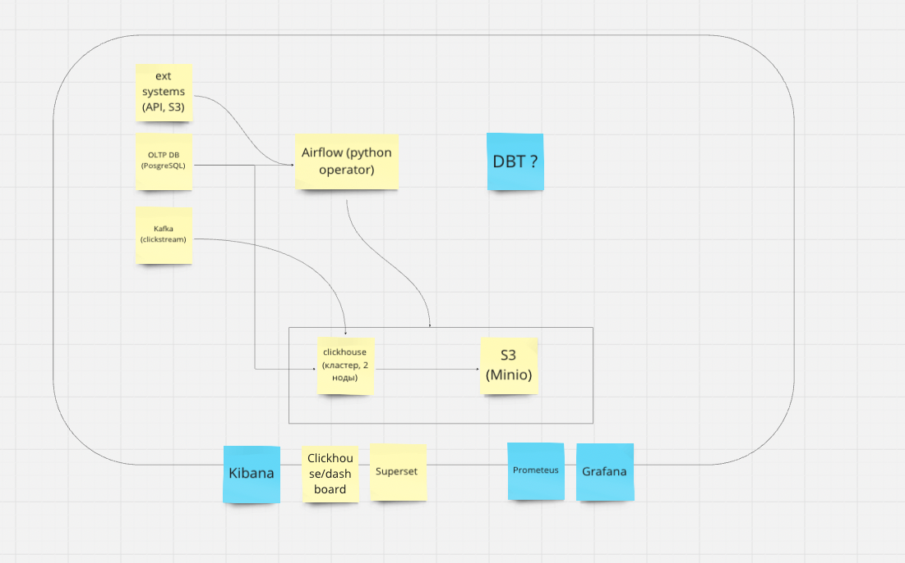
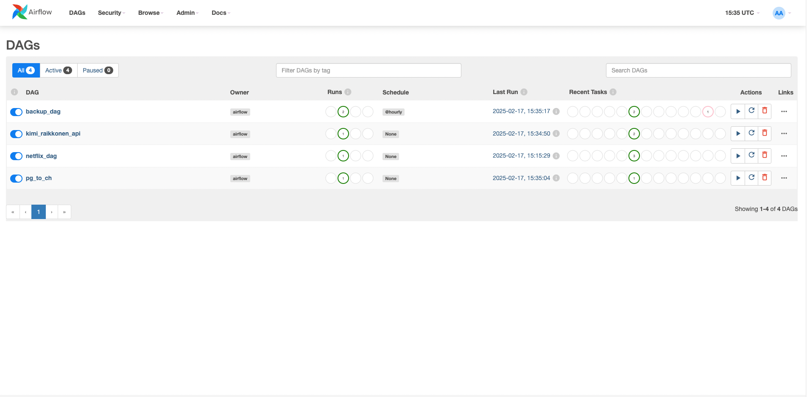
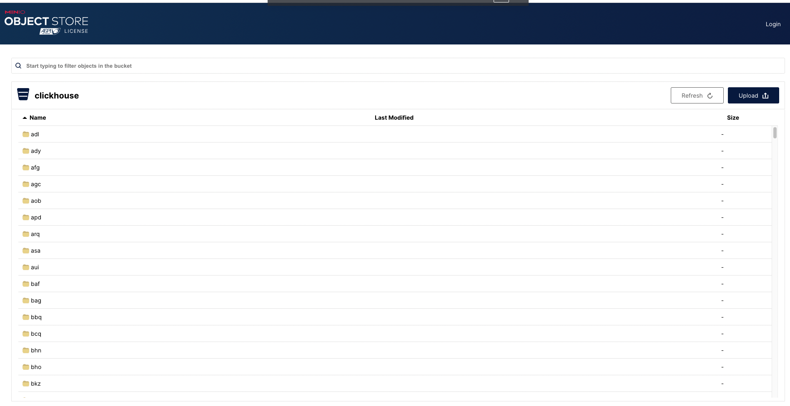
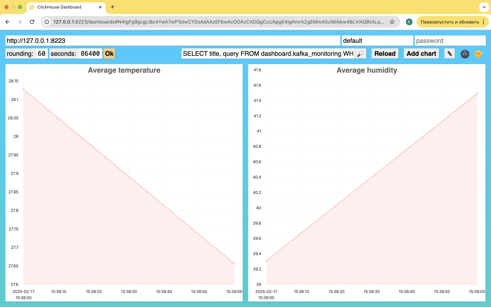
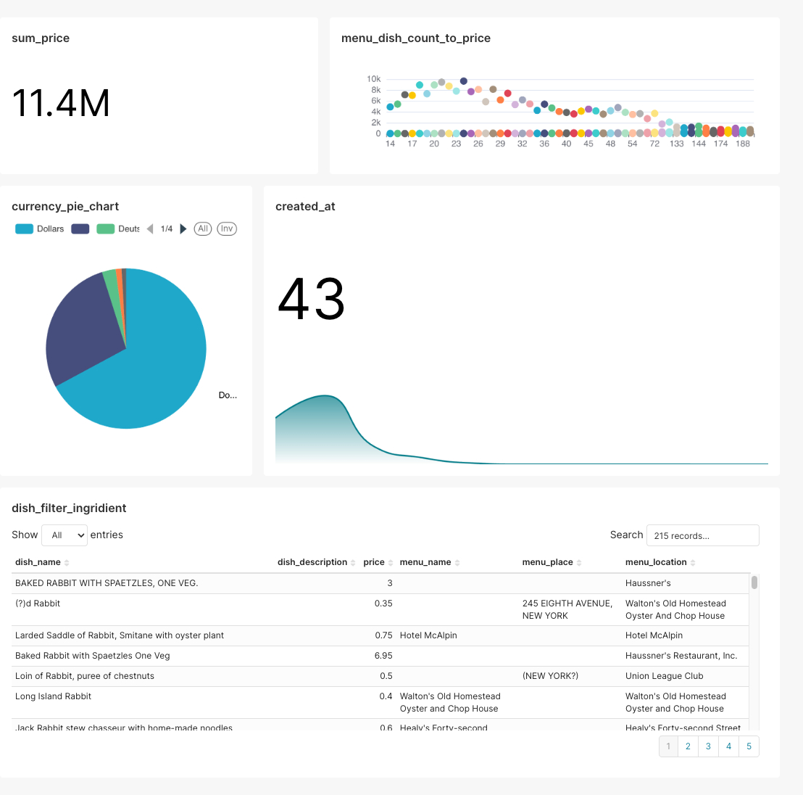
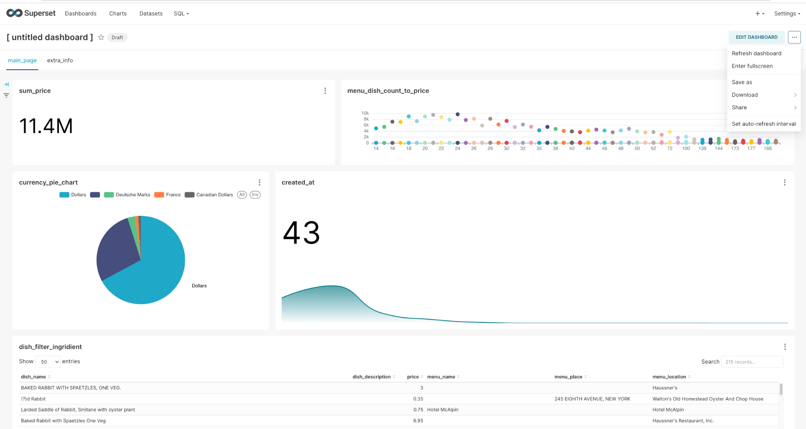

# Построение production-ready хранилища данных Такси на базе ClickHouse

Курсу "ClickHouse для инженеров и архитекторов БД".

Темы для проекта

1. Построение production-ready хранилища данных Такси на базе ClickHouse.
2. Изучение скорости обновления и целостности данных для различных способов их загрузки в хранилище данных.
3. Почти онлайн обработка данных на основе ClickHouse Materialized Views.
4. Clickhouse для искусственного интеллекта.
5. Использование dbt для трансформации данных в ClickHouse.

## Установка

```bash
# Запускаем наш проект
docker-compose up -d

# Поднимаем структуру БД
docker exec -it ch1 clickhouse-client --queries-file /otus-clickhouse/ch/init_db/01_rbac.sql
docker exec -it ch1 clickhouse-client --queries-file /otus-clickhouse/ch/init_db/00_databases_and_tables.sql

# Ставим суперсет
docker exec -it superset superset fab create-admin \
          --username admin \
          --firstname Superset \
          --lastname Admin \
          --email admin@superset.com \
          --password admin

docker exec -it superset superset db upgrade
docker exec -it superset superset init
docker exec -it superset python -m pip install clickhouse-connect
docker restart superset
```

## ПО и подходы, которые были использованы в проекте.

- Clickhouse - основная аналитическая БД
- Airflow - оркестратор, через который мы:
  - забираем данные из внешних систем
  - с определенной периодичностью снимаем бэкапы
- PostgreSQL - выполняет 2 функции
  - внутренняя СУБД для работы Airflow
  - имитация prod-a (OLTP) - отсюда забираются нормализованные таблицы через оркестратор, словари и специальный движок PostgreSQL
- Kafka - еще один источник данных
- Minio - для хранения бэкапов и политик хранения
- Superset - для аналитических дашбордов

Схема архитектуры



Здесь желтым отмечены уже реализованные элементы, синим - то, что можно добавить.

## Описательная часть

Описание файлов в репозитории

- airflow
  - dags - даги в эирфлоу
  - scripts - баш-скрипт, который используем для раскатки эирфлоу (заводим пользователя, ставим необходимые пакеты)
- ch
  - init_db - скрипты, создающие необходимые объекты в БД
  - replica01 && replica02 - конфиги на ноды clickhouse
- minio - директория в gitignore, для локальной сверки что все бэкапы/гибридное хранение успешны
- src - вспомогательный скрипт с кафка продюссером на python (для демонстрации связки кафка-кликхаус)

Описание [структуры БД](./ch/init_db/00_databases_and_tables.sql)

- streams - База данных с консьюмерами кафки
- raw - База данных с сырыми данными из кафки (данные хранятся как json в строке + метаданные кафки)
- parsed - База данных с распаршенными данными из кафки
- dict - База данных со словарями
- airflow_metadata - База данных с метаданными Airflow (движок PostgreSQL)
- ext - База данных, куда складываем данные из внешних систем (апи, парсинг и тд)
- prod - База данных, куда складываем данные из прода (ОЛТП базы данных)
- datamart - Основная БД для запросов со стороны BI. Единственная таблица - datamart.trips
- dashboard - БД для мониторинга

Конечно! Вот улучшенная и расширенная версия с более структурированным изложением и техническими деталями:

## Внешние источники данных

Система интегрирована с разнообразными внешними источниками данных через Apache Airflow, доступный по адресу: `http://localhost:8001/home`

### Реализованные коннекторы:

1. **PostgreSQL → ClickHouse**

   - Реализован через [DAG](./airflow/dags/pg_to_ch.py), имитирующий промышленную связку OLTP (PostgreSQL) и OLAP (ClickHouse) систем
   - Поддержка как прямого переноса данных, так и использование таблиц с движком PostgreSQL и словарей для прямого доступа
   - **Результат проверки:** После выполнения DAG в целевой таблице содержится 39 записей

2. **REST API → ClickHouse**

   - Реализован через [DAG для API Kimi Raikkonen](./airflow/dags/kimi_raikkonen_api.py)
   - Использована таблица с движком ReplacingMergeTree для автоматического устранения дубликатов и избежания необходимости UPDATE операций
   - Данные загружаются из открытых источников с сохранением истории изменений

3. **Объектное хранилище S3 → ClickHouse**

   - Реализован через [Netflix DAG](./airflow/dags/netflix_dag.py) для загрузки данных из внешнего S3-совместимого хранилища
   - Поддержка форматов Parquet, CSV через автоматическое определение схемы

4. **Apache Kafka → ClickHouse**
   - Реализован через [кастомный продюсер](./src/kafka_producer.py)
   - Настроена потоковая загрузка данных с поддержкой различных форматов сообщений
   - Автоматическое создание таблиц в ClickHouse на основе схемы данных из Kafka

Все DAG'ы успешно выполняются, что подтверждается скриншотом интерфейса Airflow:


Полный код DAG'ов доступен в [директории](./airflow/dags/)

## Система управления доступом (RBAC)

Перед созданием бизнес-объектов базы данных выполняется развертывание [RBAC-инфраструктуры](./ch/init_db/01_rbac.sql), включающей:

### Реализованные сущности:

- **Пользователи** с различными уровнями доступа
- **Роли** с гранулярными permissions
- **Политики безопасности** и квоты
- **Профили настроек** для различных категорий пользователей
- **Именованные коллекции** для упрощения управления доступом

### Текущие роли в системе:

```sql
SELECT * FROM system.roles;
/*
┌─name────────────┬─id───────────────────────────────────┬─storage─────────┐
│ observer_r      │ 7b4d9a4a-9677-220d-2ee1-12e30c90fda8 │ local_directory │
│ bi_r            │ 9b49a98a-f84b-886d-e2a4-16eeb87691a9 │ local_directory │
│ airflow_r       │ 444c014a-d933-af58-d468-a8f02b35baaf │ local_directory │
│ data_engineer_r │ 5a4c792e-9c70-e7ad-b1b0-e989cdaf2c84 │ local_directory │
│ monitoring_r    │ 7c44ec3f-d9c7-ba88-e0bc-4c46a83e91ba │ local_directory │
│ analytic_r      │ 6e441ff2-fd21-afcb-a5a4-9fbfb1e1c5b6 │ local_directory │
└─────────────────┴──────────────────────────────────────┴─────────────────┘
*/
```

### Тестирование системы безопасности:

**Тест квот на ошибки** (пользователь `student`):

```bash
clickhouse-client --user student --password student_otus
# Последовательные ошибочные запросы:
seclect 1;  # 6 раз
```

**Результат:** После 6 ошибок система блокирует пользователя с сообщением:

```
Code: 201. DB::Exception: Quota for user `student` for 3600s has been exceeded: errors = 9/5.
Interval will end at 2025-02-18 17:00:00.
Name of quota template: `five_errors_quota`. (QUOTA_EXCEEDED)
```

**Тест таймаутов запросов** (пользователь `bi`):

```sql
-- Запрос с принудительным долгим выполнением
SELECT count()
FROM (SELECT number AS id FROM numbers(10e8)) AS t1
JOIN (SELECT number AS id FROM numbers(1, 10e8, 100)) AS t2
    USING (id);
```

**Результат:** Запрос прерывается после 5 секунд:

```
Code: 159. DB::Exception: Timeout exceeded: elapsed 5.002511377 seconds, maximum: 5. (TIMEOUT_EXCEEDED)
```

## Система бэкапов и политик хранения

### Конфигурация объектного хранилища:

- Использован **MinIO** как S3-совместимое open-source решение
- Доступ через: `http://localhost:10001/browser/clickhouse`
- [Конфигурация](./ch/replica01/config.d/storage_policy.xml) включает многоуровневое хранение

### Проверка конфигурации хранилища:

```sql
SELECT policy_name, volume_name FROM system.storage_policies;
/*
┌─policy_name─┬─volume_name─┐
│ default     │ default     │
│ default     │ s3_backup   │
│ s3_backup   │ s3_backup   │
└─────────────┴─────────────┘
*/

SELECT name, path, type, object_storage_type FROM system.disks;
/*
┌─name──────┬─path─────────────────────────────────┬─type──────────┬─object_storage_type─┐
│ default   │ /var/lib/clickhouse/                 │ Local         │ None                │
│ s3_backup │ /var/lib/clickhouse/disks/s3_backup/ │ ObjectStorage │ S3                  │
│ s3_cache  │ /var/lib/clickhouse/disks/s3_cold/   │ ObjectStorage │ S3                  │
│ s3_cold   │ /var/lib/clickhouse/disks/s3_cold/   │ ObjectStorage │ S3                  │
└───────────┴──────────────────────────────────────┴───────────────┴─────────────────────┘
*/
```

### Стратегия бэкапов:

- **Ежечасные инкрементальные бэкапы** через [Airflow DAG](./airflow/dags/backup_dag.py)
- **Еженедельные полные бэкапы** (суббота, 3:00 AM)
- Использование Native ClickHouse Backup commands:

```sql
-- Полный бэкап
BACKUP ALL TO Disk('s3_backup', 'backup_20250216');

-- Инкрементальный бэкап
BACKUP ALL TO Disk('s3_backup', 'backup_20250216_08')
    SETTINGS base_backup = Disk('s3_backup', 'backup_20250216');

-- Мониторинг статуса бэкапов
SELECT id, name, status FROM system.backups;
```

### Холодное хранение данных:

Настроена автоматическая миграция данных на холодное хранение на основе политик TTL

**Статистика распределения данных:**

```sql
SELECT
    table,
    disk_name,
    formatReadableSize(SUM(data_compressed_bytes)) AS compressed_size,
    formatReadableSize(SUM(data_uncompressed_bytes)) AS uncompressed_size,
    SUM(rows) AS total_rows
FROM system.parts
WHERE active = 1 AND table = 'trips'
GROUP BY table, disk_name
ORDER BY table, disk_name;
/*
┌─table─┬─disk_name─┬─compressed_size─┬─uncompressed_size─┬─total_rows─┐
│ trips │ default   │ 4.19 MiB        │ 6.94 MiB          │     100000 │
│ trips │ s3_cold   │ 121.33 MiB      │ 206.83 MiB        │    3000317 │
└───────┴───────────┴─────────────────┴───────────────────┴────────────┘
*/
```



## Система мониторинга и визуализации

### Мониторинг логов:

Реализовано расширенное логирование через [дополнительные конфигурации](./ch/replica01/config.d/additional_logs.xml)

**Логи сессий:**

````sql
SELECT hostname, type, event_time_microseconds, user, client_name
FROM system.session_log;
/*
┌─hostname────┬─type─────────┬────event_time_microseconds─┬─user────┬─client_name───────┐
│ clickhouse2 │ LoginSuccess │ 2025-02-18 16:08:22.200474 │ default │ ClickHouse client │
└─────────────┴──────────────┴────────────────────────────┴─────────┴───────────────────┘
*/

**Логи ошибок:**
```sql
SELECT * FROM system.error_log LIMIT 1;
/*
┌─hostname────┬─event_date─┬──────────event_time─┬─code─┬─error─────────────┬─value─┬─remote─┐
│ clickhouse2 │ 2025-02-18 │ 2025-02-18 15:52:29 │  107 │ FILE_DOESNT_EXIST │     1 │      0 │
└─────────────┴────────────┴─────────────────────┴──────┴───────────────────┴───────┴────────┘
*/
````

### Встроенный мониторинг ClickHouse:

Доступен через эндпоинт: `127.0.0.1:8223/dashboards`

**Пример мониторинга Kafka потребителей:**

```sql
SELECT title, query FROM dashboard.kafka_monitoring WHERE dashboard = 'Overview'
```



### Визуализация в Apache Superset:

Доступен через: `http://localhost:8080/`

**Настройка подключения:**

1. Авторизация в Superset
2. Добавление connection к ClickHouse (Settings → Database Connections)
3. Создание датасета на основе денормализованной таблицы `datamart.trips`
4. Использование кастомного SQL: `SELECT * FROM datamart.trips LIMIT 5`

**Примеры реализованных дашбордов:**





Система обеспечивает комплексный мониторинг работоспособности, производительности и использования ресурсов, а также предоставляет богатые возможности для визуализации данных и бизнес-аналитики.

## Заключение

В рамках текущей реализации была построена базовая инфраструктура для работы с данными, однако для промышленной эксплуатации системы потребуется реализация дополнительных компонентов и архитектурных решений:

**Мониторинг и observability:**

- Текущий мониторинг основан на встроенных возможностях ClickHouse через эндпоинт `/dashboard`, что подходит для разработки и тестирования
- Для production-среды рекомендую внедрение полноценной системы мониторинга на основе Prometheus для сбора метрик и Grafana для визуализации и создания дашбордов
- Представленный в документации вариант развертывания может служить отправной точкой для построения комплексной системы мониторинга

**Управление логами:**

- В текущей реализации логи сохраняются в системные таблицы ClickHouse, что уже является улучшением по сравнению с прямым доступом к файловой системе
- Для enterprise-решения следует рассмотреть внедрение ELK-стека (Elasticsearch, Logstash, Kibana) или развертывание выделенного кластера для централизованного сбора, хранения и анализа логов со всех компонентов системы

**Безопасность и управление доступом:**

- В текущей конфигурации секреты распределены по различным файлам репозитория, а пользователи создаются вручную, что создает риски безопасности
- Для production-среды необходимо внедрить HashiCorp Vault или аналогичное решение для централизованного управления секретами
- Рекомендую интеграцию с корпоративными системами аутентификации через LDAP/Active Directory и реализацию ролевой модели доступа (RBAC)

**Data Lineage и управление метаданными:**

- По мере усложнения архитектуры и увеличения количества пайплайнов возникнет потребность в отслеживании происхождения данных и их преобразований
- Для решения этой задачи рекомендую рассмотреть внедрение OpenMetadata или DBT (Data Build Tool) для обеспечения прозрачности данных и упрощения их документирования

**Оптимизация вычислений и хранения данных:**

- ClickHouse оптимизирован для аналитических запросов и не предназначен для построения сложных витрин данных с многоступенчатыми преобразованиями
- Для сложных ETL-процессов и построения витрин рекомендую рассмотреть:
  - Greenplum как решение для сложных вычислений (для организаций с ограниченным бюджетом)
  - Vertica для enterprise-решений с высокими требованиями к производительности
  - Современные подходы: связку Trino + Apache Iceberg для работы с большими данными или развертывание Apache Spark на Kubernetes для распределенных вычислений

Данные предложения позволят создать масштабируемую, отказоустойчивую и безопасную инфраструктуру, готовую к обработке растущих объемов данных и усложнению бизнес-требований.
